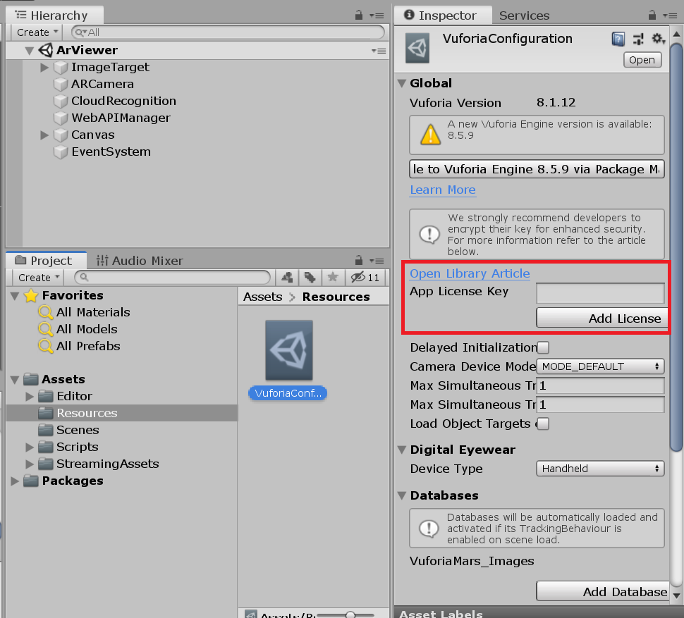
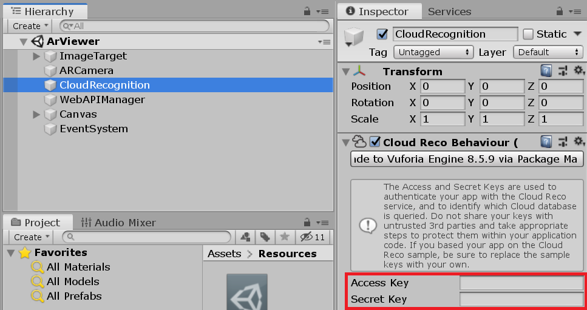
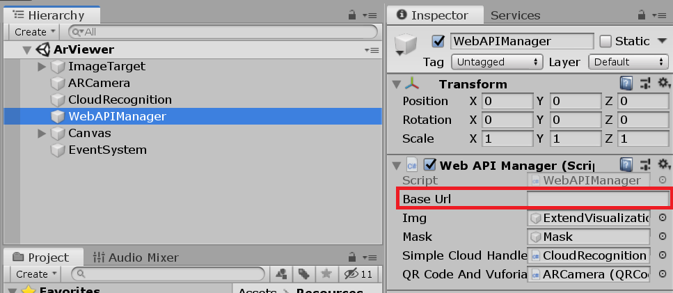

# PapARVis Designer: AR Viewer
This is an example of the endpoint of **PapARVis Designer** for audiences to view the augmented static visualization. The viewer is built using Unity with Vuforia.

## Download
A demo [apk](demo.apk) is built for download.

## How to use AR Viewer
1. Scan the QR code on static visualization that is published from **[VegaAR Editor]()** (TODO: link to editor).
2. Scan the static visualization to view the augemented visualization.

## Development
All source codes are available in this repo. To build the project by yourself, clone this repo and open with Unity.

### Configuration
To use Vuforia in Unity, an account is needed. Please register [here](https://developer.vuforia.com/).

After registration, create a license key and copy it to App License Key under ```Assets/Resources/VuforiaConfiguration.asset``` as shown below.


Moreover, Vuforia Could Reco service is required. Create a Cloud Database in Vuforia by following the instructions [here](https://library.vuforia.com/content/vuforia-library/en/articles/Solution/How-To-Work-with-Cloud-Databases.html). Copy Client Access Keys to CloudRecognition in ArViewer.


Lastly, we need to fetch data from SpecHub backend. The backend URL should be filled in WebAPIManager in ArViewer as illustrated in the following.


#### Environment
- Unity version: 2019.2.0b6
- Vuforia Engine AR: 8.1.12
